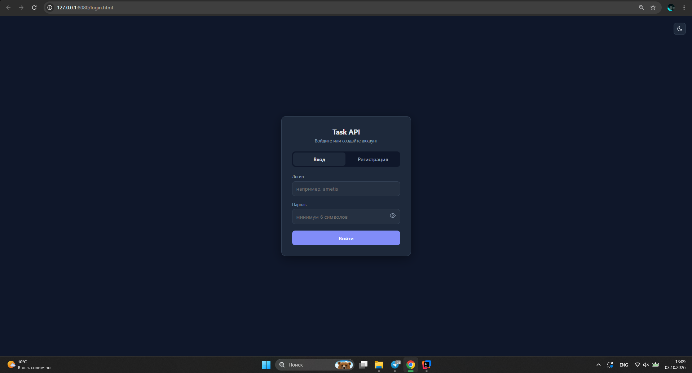
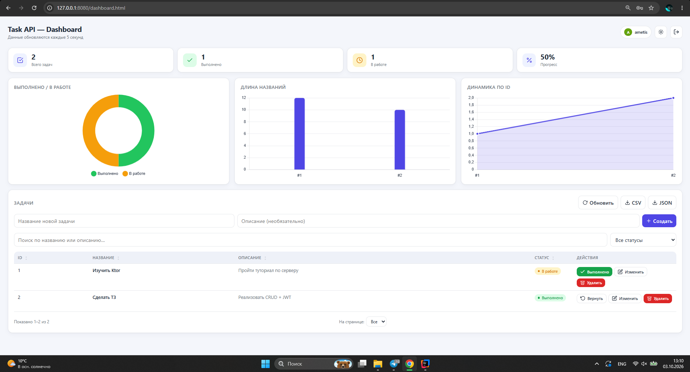
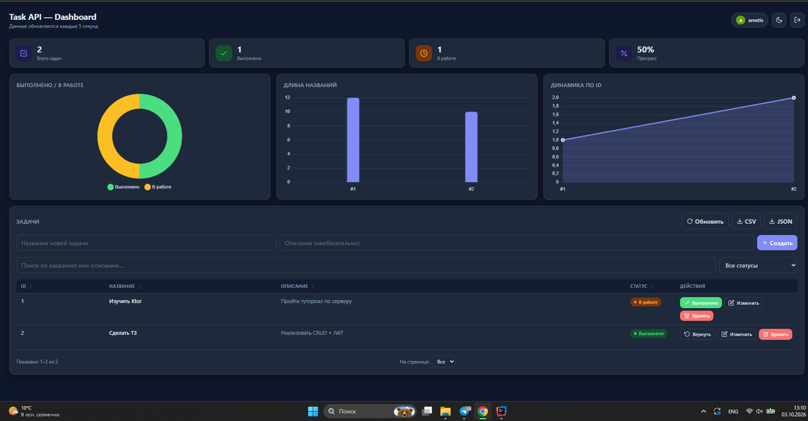

<h1 align="center">Task API</h1>

<p align="center">
  CRUD + JWT-аутентификация на Kotlin/Ktor с веб-дашбордом
</p>

<p align="center">
  
  
  
  
</p>

---

## Содержание

- [Возможности](#возможности)
- [Скриншоты](#скриншоты)
- [Стек](#стек)
- [Требования](#требования)
- [Запуск](#запуск)
- [Структура проекта](#структура-проекта)
- [Аутентификация](#аутентификация)
- [Маршруты](#маршруты)
  - [POST /auth/register](#post-authregister)
  - [POST /auth/login](#post-authlogin)
  - [GET /tasks](#get-tasks)
  - [GET /tasks/{id}](#get-tasksid)
  - [POST /tasks](#post-tasks)
  - [PUT /tasks/{id}](#put-tasksid)
  - [DELETE /tasks/{id}](#delete-tasksid)
  - [GET /api/health](#get-apihealth)
- [Коды ответов](#коды-ответов)
- [Веб-интерфейс](#веб-интерфейс)
- [Безопасность](#безопасность)
- [Тестирование через PowerShell](#тестирование-через-powershell)

---

## Возможности

- **CRUD** для сущности «Задача»: список, получение по id, создание, обновление, удаление.
- **JWT-аутентификация**: регистрация, вход, защищённые маршруты, полезные claims (`userId`, `login`).
- **BCrypt** для хранения паролей (cost = 12).
- **JSON** через `ContentNegotiation` + `kotlinx.serialization`.
- **Query и path параметры**: `?completed=`, `?limit=`, `/tasks/{id}`.
- **Корректные HTTP-коды**: 200, 201, 204, 400, 401, 404, 409, 500.
- **Веб-дашборд**: графики (Chart.js), метрики, поиск, фильтр, сортировка, пагинация, тёмная/светлая тема, экспорт CSV/JSON.

## Скриншоты

### Страница входа

<p align="center">
  
</p>

### Дашборд — светлая тема

<p align="center">
  
</p>

### Дашборд — тёмная тема

<p align="center">
  
</p>

---

## Стек

- **Kotlin** 1.9.22
- **Ktor** 2.3.12 (Netty, `ContentNegotiation`, `Authentication`/JWT, `StatusPages`, `CallLogging`)
- **kotlinx.serialization** — JSON
- **BCrypt** (`at.favre.lib:bcrypt`) — хэширование паролей
- **Chart.js** — графики на дашборде
- **Gradle** 8+ (проект проверен на Gradle 9.5)
- **JDK** 17+

## Требования

- JDK 17 или новее
- Git
- Внешние БД не нужны — данные хранятся в памяти

Проверка версии JDK:

```bash
java -version
```

## Запуск

### Windows (PowerShell)

```powershell
.\gradlew.bat run
```

### Linux / macOS

```bash
./gradlew run
```

После старта:

```
INFO  Application - Responding at http://0.0.0.0:8080
```

Сервер доступен по адресу **http://localhost:8080**.

Первый запуск скачивает зависимости (1–3 минуты), последующие — быстрые. Остановка: `Ctrl + C`.

## Структура проекта

```
ktor/
├── build.gradle.kts
├── settings.gradle.kts
├── gradle.properties
├── README.md
├── image.png
├── docs/
│   └── screenshots/
│       ├── login.png
│       ├── dashboard_light.png
│       └── dashboard_black.png
└── src/main/
    ├── kotlin/com/example/
    │   ├── Application.kt          # точка входа, плагины, маршрутизация
    │   ├── models/
    │   │   ├── Task.kt             # Task, DTO, ErrorResponse
    │   │   └── User.kt             # User, DTO, запросы и ответы auth
    │   ├── repositories/
    │   │   ├── TaskRepository.kt
    │   │   └── UserRepository.kt
    │   ├── security/
    │   │   ├── JwtConfig.kt
    │   │   └── PasswordHasher.kt
    │   └── routes/
    │       ├── AuthRouter.kt       # /auth/register, /auth/login
    │       └── TaskRouter.kt       # /tasks CRUD
    └── resources/
        ├── logback.xml
        └── static/
            ├── login.html
            ├── dashboard.html
            ├── css/
            │   ├── base.css
            │   ├── auth.css
            │   └── dashboard.css
            └── js/
                ├── shared.js
                ├── auth.js
                └── dashboard.js
```

## Аутентификация

- **Регистрация** — `POST /auth/register`, пароль хэшируется BCrypt.
- **Вход** — `POST /auth/login`, проверка пароля через `BCrypt.verifyer()`, при успехе выдаётся JWT.
- **Токен** содержит claims `userId`, `login`, `iss`, `aud`, `iat`, `exp`; срок жизни — 1 час.
- **Защищённые маршруты** требуют заголовок:

  ```
  Authorization: Bearer <TOKEN>
  ```

- **Публичные маршруты**: `GET /tasks`, `GET /tasks/{id}`, `POST /auth/register`, `POST /auth/login`, `GET /api/health`.

Получить токен:

```bash
curl -s -X POST http://localhost:8080/auth/login \
  -H "Content-Type: application/json" \
  -d '{"login":"ametis","password":"secret123"}'
```

Ответ:

```json
{
  "token": "eyJhbGciOiJIUzI1NiJ9...",
  "user": { "id": 1, "login": "ametis" },
  "expiresInSeconds": 3600
}
```

## Маршруты

### POST /auth/register

Регистрация нового пользователя.

**Тело запроса**

```json
{ "login": "ametis", "password": "secret123" }
```

**Успех** — `201 Created`

```json
{ "id": 1, "login": "ametis" }
```

**Ошибки**: `400` (пустые поля, короткий пароль), `409` (логин занят).

```bash
curl -i -X POST http://localhost:8080/auth/register \
  -H "Content-Type: application/json" \
  -d '{"login":"ametis","password":"secret123"}'
```

```powershell
Invoke-RestMethod -Uri http://localhost:8080/auth/register -Method Post `
  -ContentType "application/json" `
  -Body '{"login":"ametis","password":"secret123"}'
```

---

### POST /auth/login

Вход и получение JWT.

**Тело запроса**

```json
{ "login": "ametis", "password": "secret123" }
```

**Успех** — `200 OK`

```json
{
  "token": "eyJhbGciOiJIUzI1NiJ9...",
  "user": { "id": 1, "login": "ametis" },
  "expiresInSeconds": 3600
}
```

**Ошибки**: `400` (некорректный JSON), `401` (неверные данные).

```bash
curl -i -X POST http://localhost:8080/auth/login \
  -H "Content-Type: application/json" \
  -d '{"login":"ametis","password":"secret123"}'
```

```powershell
$resp = Invoke-RestMethod -Uri http://localhost:8080/auth/login -Method Post `
  -ContentType "application/json" `
  -Body '{"login":"ametis","password":"secret123"}'

$h = @{ Authorization = "Bearer $($resp.token)" }
```

---

### GET /tasks

Публичный. Список задач.

**Query-параметры**
- `completed` — `true` / `false`
- `limit` — положительное число

**Успех** — `200 OK`

```json
[
  { "id": 1, "title": "Изучить Ktor", "description": "Пройти туториал", "completed": false, "ownerId": 1 },
  { "id": 2, "title": "Сделать ТЗ", "description": "Реализовать CRUD + JWT", "completed": true, "ownerId": 1 }
]
```

**Ошибки**: `400` (некорректные query-параметры).

```bash
curl http://localhost:8080/tasks
curl "http://localhost:8080/tasks?completed=false&limit=5"
```

```powershell
Invoke-RestMethod http://localhost:8080/tasks
Invoke-RestMethod "http://localhost:8080/tasks?completed=false&limit=5"
```

---

### GET /tasks/{id}

Публичный. Одна задача по id.

**Успех** — `200 OK`

**Ошибки**: `400` (`id` не число), `404` (не найдено).

```bash
curl -i http://localhost:8080/tasks/1
```

```powershell
Invoke-RestMethod http://localhost:8080/tasks/1
```

---

### POST /tasks

**Требует JWT** (`Authorization: Bearer <TOKEN>`).

**Тело запроса** (DTO без `id`)

```json
{ "title": "Купить молоко", "description": "2 литра", "completed": false }
```

**Успех** — `201 Created`

```json
{ "id": 3, "title": "Купить молоко", "description": "2 литра", "completed": false, "ownerId": 1 }
```

**Ошибки**: `400`, `401`.

```bash
curl -i -X POST http://localhost:8080/tasks \
  -H "Content-Type: application/json" \
  -H "Authorization: Bearer $TOKEN" \
  -d '{"title":"Купить молоко","description":"2 литра"}'
```

```powershell
Invoke-RestMethod -Uri http://localhost:8080/tasks -Method Post -Headers $h `
  -ContentType "application/json" `
  -Body '{"title":"Купить молоко","description":"2 литра"}'
```

---

### PUT /tasks/{id}

**Требует JWT**.

**Тело запроса** (любое поле опционально)

```json
{ "completed": true }
```

**Успех** — `200 OK`.

**Ошибки**: `400`, `401`, `404`.

```bash
curl -i -X PUT http://localhost:8080/tasks/1 \
  -H "Content-Type: application/json" \
  -H "Authorization: Bearer $TOKEN" \
  -d '{"completed":true}'
```

```powershell
Invoke-RestMethod -Uri http://localhost:8080/tasks/1 -Method Put -Headers $h `
  -ContentType "application/json" `
  -Body '{"completed":true}'
```

---

### DELETE /tasks/{id}

**Требует JWT**.

**Успех** — `204 No Content`.

**Ошибки**: `400`, `401`, `404`.

```bash
curl -i -X DELETE http://localhost:8080/tasks/1 \
  -H "Authorization: Bearer $TOKEN"
```

```powershell
(Invoke-WebRequest -Uri http://localhost:8080/tasks/1 -Method Delete -Headers $h).StatusCode
```

---

### GET /api/health

Публичный health-check.

```json
{ "status": "ok" }
```

```bash
curl http://localhost:8080/api/health
```

---

## Коды ответов

| Код | Когда возвращается |
|-----|--------------------|
| 200 | Успешный GET / PUT / POST `/auth/login` |
| 201 | Задача создана / пользователь зарегистрирован |
| 204 | Задача удалена |
| 400 | Некорректный JSON, пустые обязательные поля, неверные query-параметры или `id` |
| 401 | Нет или невалидный JWT; неверный логин/пароль |
| 404 | Задача или маршрут не найдены |
| 409 | Логин уже занят |
| 500 | Внутренняя ошибка сервера |

Формат ошибки:

```json
{ "error": "Описание ошибки", "code": 400 }
```

## Веб-интерфейс

После запуска сервера:

- **http://localhost:8080/** — редирект на дашборд (без токена — на страницу входа)
- **http://localhost:8080/login.html** — вход / регистрация
- **http://localhost:8080/dashboard.html** — дашборд

Возможности дашборда:

- метрики: всего, выполнено, в работе, процент;
- три графика (Chart.js): статус, длина названий, динамика по id;
- создание задачи с названием и описанием;
- переключение статуса «Выполнено / Вернуть»;
- редактирование через модальное окно;
- удаление с подтверждением;
- поиск по названию/описанию;
- фильтр по статусу;
- сортировка по клику на заголовок столбца;
- пагинация (5 / 10 / 25 / 50 / Все);
- экспорт текущего списка в **CSV** и **JSON**;
- светлая/тёмная тема с сохранением выбора;
- автообновление каждые 5 секунд;
- JWT хранится в `localStorage`, при истечении — автоматический выход.

## Безопасность

- Пароли хранятся только в виде **BCrypt-хэшей** (cost = 12).
- Проверка пароля — через `BCrypt.verifyer().verify(...)`, не сравнение строк.
- **JWT** подписан HMAC256; секрет — в `security/JwtConfig.kt` (для продакшена вынести в переменную окружения).
- Токен содержит `userId`, `login`, `iss`, `aud`, `iat`, `exp`.
- Защищённые маршруты возвращают `401` без валидного токена.
- Пароль никогда не возвращается клиенту — в ответе только `UserDto(id, login)`.

## Тестирование через PowerShell

```powershell
# 1. Регистрация
Invoke-RestMethod -Uri http://localhost:8080/auth/register -Method Post `
  -ContentType "application/json" `
  -Body '{"login":"ametis","password":"secret123"}'

# 2. Логин — сохраняем токен
$resp = Invoke-RestMethod -Uri http://localhost:8080/auth/login -Method Post `
  -ContentType "application/json" `
  -Body '{"login":"ametis","password":"secret123"}'
$h = @{ Authorization = "Bearer $($resp.token)" }

# 3. Публичное чтение
Invoke-RestMethod http://localhost:8080/tasks
Invoke-RestMethod http://localhost:8080/tasks/1

# 4. Создание с токеном
Invoke-RestMethod -Uri http://localhost:8080/tasks -Method Post -Headers $h `
  -ContentType "application/json" `
  -Body '{"title":"Новая задача","description":"Описание"}'

# 5. Обновление
Invoke-RestMethod -Uri http://localhost:8080/tasks/1 -Method Put -Headers $h `
  -ContentType "application/json" `
  -Body '{"completed":true}'

# 6. Удаление — проверяем 204
(Invoke-WebRequest -Uri http://localhost:8080/tasks/1 -Method Delete -Headers $h).StatusCode

# 7. Проверка защиты: без токена должно быть 401
try {
  Invoke-RestMethod -Uri http://localhost:8080/tasks -Method Post `
    -ContentType "application/json" -Body '{"title":"Без токена"}'
} catch {
  $_.Exception.Response.StatusCode.value__
}
```

---

<p align="center">
  <sub>Учебный проект · Kotlin / Ktor · 2026</sub>
</p>